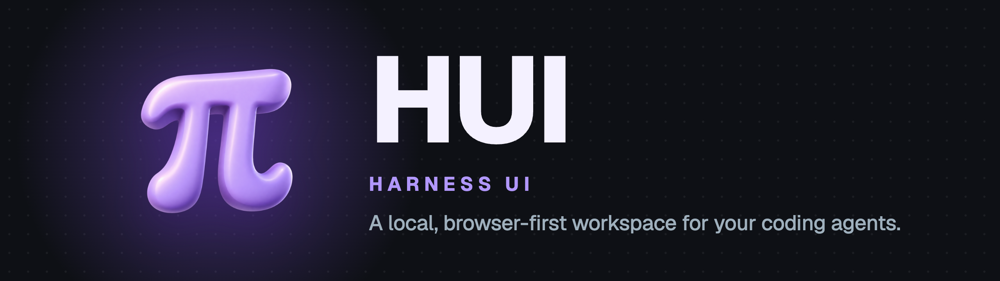

<p align="center">
  <picture>
    <source media="(prefers-color-scheme: light)" srcset="docs/assets/hui-banner-light.png">
    
  </picture>
</p>

<p align="center">
  <a href="https://github.com/DaniFdz/hui/releases/latest"></a>
  <a href="https://github.com/DaniFdz/hui/actions/workflows/nix.yml"></a>
  <a href="https://nodejs.org"></a>
  <a href="https://pi.dev"></a>
  <a href="LICENSE"></a>
</p>

**HUI (HarnessUI) is a local, browser-first control surface for coding-agent
harnesses.** It gives you a focused workspace for sessions, transcripts, models,
settings and gateway operations while leaving agent configuration and
conversation history with [PI](https://pi.dev).

HUI currently runs with full access. It does not add an approval layer or copy
PI transcripts into its own storage.

<p align="center">
  <a href="#install">Install</a> · <a href="#quick-start">Quick start</a> · <a href="docs/guide.md">User guide</a> · <a href="https://github.com/DaniFdz/hui/releases">Releases</a> · <a href="CONTRIBUTING.md">Contributing</a> · <a href="SECURITY.md">Security</a>
</p>

<table>
<tr><td><b>Organized sessions</b></td><td>Grouped, searchable sessions with persistent drafts.</td></tr>
<tr><td><b>Live agent work</b></td><td>Live transcripts, streaming status, tool activity and model controls.</td></tr>
<tr><td><b>A gateway that keeps running</b></td><td>A local gateway that keeps running independently of the browser window.</td></tr>
<tr><td><b>One place for settings</b></td><td>Appearance, skills, tools, models and workspace settings in one UI.</td></tr>
<tr><td><b>A browser for your agents</b></td><td>A dedicated, headless-by-default browser agents can drive without touching your own browser, with a live preview of its page in the chat (Settings → Tools → Browser).</td></tr>
<tr><td><b>Desktop app</b></td><td>An Electron window over the same UI and gateway, registered with Spotlight on macOS.</td></tr>
<tr><td><b>Safe updates</b></td><td>Transactional local updates with verification and rollback support.</td></tr>
</table>

## Install

Requirements:

- Node.js **22.18 or newer** and npm.
- Git for source checkouts.
- Optional: Google Chrome, Brave, Microsoft Edge or Chromium for the agent
  browser tool. HUI launches it with its own profile; nothing is downloaded.

HUI is distributed as npm archives (`.tgz`), not through the public npm
registry.

### Stable release

Download the `.tgz` archive and matching `.sha256` file from the
[latest GitHub Release](https://github.com/DaniFdz/hui/releases/latest), then
verify and install it globally:

```sh
mkdir -p ~/Downloads/hui-release
cd ~/Downloads/hui-release
sha256sum --check hui-*.tgz.sha256  # macOS: shasum -a 256 --check
npm install --global --prefix ~/.local ./hui-*.tgz
```

### Current `main` build

From a checkout of this repository, when testing unreleased work:

```sh
npm ci
npm pack
npm install --global --prefix ~/.local ./hui-*.tgz
```

This installs the current source commit. It is a development build, not a
stable update channel.

### Nix and the desktop app

On Linux, the flake builds the web and desktop packages and provides a NixOS
service module; Nix supplies Node.js itself. See [Nix and NixOS](docs/guide.md#nix-and-nixos).
On macOS, a global npm install also registers `~/Applications/HUI.app` for
Spotlight and the Dock; see [Desktop app](docs/guide.md#desktop-app-and-spotlight-macos).

## Quick start

```sh
export PATH="$HOME/.local/bin:$PATH"
hui gateway start
hui ui
```

Then open **Settings → Models** to connect a provider
([details](docs/guide.md#model-providers)) and start a session.

Useful lifecycle commands:

```sh
hui gateway status
hui gateway restart
hui gateway logs --lines 100
hui gateway stop
hui desktop          # open the desktop app instead of a browser tab
```

`hui gateway logs` prints the tail of the private `gateway.log`: gateway
start-up plus every warning and error with its redacted cause, including
failures the browser reported, across restarts.
Settings → Logs shows the running gateway's entries, and **Export diagnostics**
saves them as JSON.

On a headless host, use `hui ui --no-open` to print the URL without opening a
browser. `hui browser` is an alias for `hui ui`. The development launcher is
separate from an installed production gateway.

## Updates

```sh
hui update --check
hui update
hui update --from /path/to/hui-next.tgz --sha256 <expected-sha256>
hui update --rollback
```

From the chat, `/update` opens the update flow in a dedicated **HUI update**
session under **OTHER**. The command stays in the composer and is never sent to
the model, so a failed update can be inspected and retried. Updates are
verified before activation, only run against an idle gateway, and keep the
previous release available for rollback. Nix installations update through Nix
instead.

After an update, run `hui doctor`. It reports state the new version needs
changed, such as sessions still on PI's worker, and `hui doctor --fix` changes
it while the gateway is stopped. See [the guide](docs/guide.md#after-an-upgrade-hui-doctor).

## How it fits together

- The **gateway** is a standalone local Node server. It owns HUI's session
  registry, settings and updates, and keeps sessions running when no window is
  open.
- The **browser UI** and the **desktop app** render the same Lit application and
  talk to the gateway over its local API.
- [**PI**](https://pi.dev) is the runtime backend. It owns agent configuration,
  skills, models and conversation transcripts.
- The **agent browser** is a separate Chromium-family profile the gateway
  drives for agents over a private DevTools pipe.

Built with [Vite](https://vite.dev/), [Lit](https://lit.dev/), TypeScript and
plain CSS with a shared design-token layer. The application lives in `src/`; the
local API and runtime adapters live in `server/`.

## Security and data

The gateway binds to loopback by default and has no user authentication. If
you need access from another device, explicitly bind to a trusted Tailscale
address or use an SSH tunnel:

```sh
hui gateway start --host tailnet
```

To put a reverse proxy such as `tailscale serve` in front of the loopback
gateway instead, see [Remote access](docs/guide.md#remote-access-through-a-reverse-proxy).
Keep the tailnet ACL tight. The browser's `x-hui` header is anti-CSRF, not an
authentication mechanism.

HUI stores settings, its session registry, the Pi Durable session store and
update metadata under `$XDG_CONFIG_HOME/hui` and `$XDG_DATA_HOME/hui`. PI
continues to own agent configuration and the transcripts of sessions still on
its worker.

The agent browser keeps its cookies and logins in
`$XDG_CONFIG_HOME/hui/browser/profile`, separate from your personal browser
profile. HUI controls it over a private DevTools pipe, so no debugging port is
opened.

Please report security issues privately as described in [SECURITY.md](SECURITY.md).

## Documentation

| Goal                                      | Start here                                                                                      |
| ----------------------------------------- | ----------------------------------------------------------------------------------------------- |
| Install with Nix or run the NixOS service | [Nix and NixOS](docs/guide.md#nix-and-nixos)                                                    |
| Use the desktop app and Spotlight         | [Desktop app](docs/guide.md#desktop-app-and-spotlight-macos)                                    |
| Connect model providers                   | [Model providers](docs/guide.md#model-providers)                                                |
| Reach the gateway through a proxy         | [Remote access](docs/guide.md#remote-access-through-a-reverse-proxy)                            |
| Understand the product and its contracts  | [SPEC.md](SPEC.md) · [Browser/server API](docs/api.md)                                          |
| Contribute or cut a release               | [CONTRIBUTING.md](CONTRIBUTING.md)                                                              |

## Develop

All changes land on `main` through a reviewed pull request; never push `main`
directly. Use a feature branch and the Vite development loop:

```sh
git switch main
git pull --ff-only
git switch -c feat/my-change
npm ci                         # first setup or after dependency changes
npm run dev                    # starts the Vite server and prints its URL; opens no window
npm run desktop                # build and open the Electron app against the managed gateway
```

Before handoff:

```sh
npm test
npm run typecheck
npm run build
npm run test:package
```

Then push the branch and open a pull request with `gh pr create`. See
[`CONTRIBUTING.md`](CONTRIBUTING.md) for the pull request rules, the release
workflow and the installed-package test loop.

## License

HUI is available under the [MIT License](LICENSE). Third-party attributions are
listed in [THIRD_PARTY_NOTICES.md](THIRD_PARTY_NOTICES.md).
